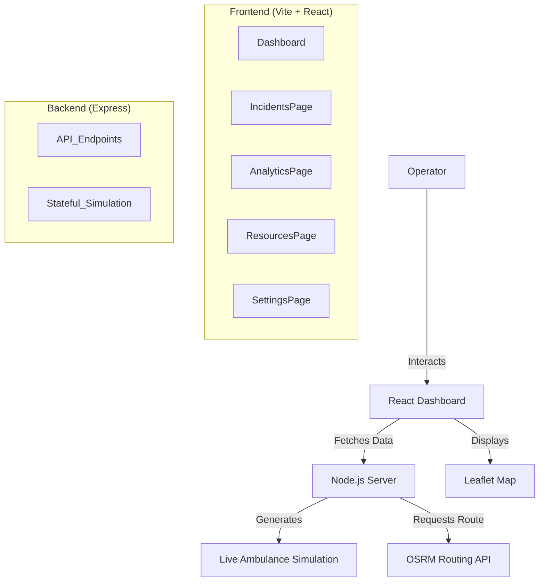

# Road Raksha - Accident Detection & Emergency Response System

## 🛡️ Project Overview
**Road Raksha** is a comprehensive solution designed to improve road safety and emergency response times. It combines real-time accident detection using computer vision (YOLOv8) with an intelligent dispatch system to coordinate ambulances and emergency services.

The system features a premium, dark-themed dashboard for operators to monitor incidents, track emergency units, and manage resources efficiently.

## 🏗️ Architecture

The project follows a modern Client-Server architecture:



### Key Components
1.  **Frontend**: Built with React, Vite, and TailwindCSS. It provides a responsive, high-performance UI for monitoring.
2.  **Backend**: A Node.js/Express server that simulates real-time ambulance telemetry (location, speed, status).
3.  **Routing Engine**: Integrates with OSRM (Open Source Routing Machine) to provide realistic, road-snapped movement for simulated vehicles.
4.  **Mapping**: Uses Leaflet and React-Leaflet for interactive maps with custom markers and overlays.

## 📂 File Structure

```
Road-Raksha/
├── dist/                   # Production build artifacts
├── MOdel/                  # YOLOv8 Model files and documentation
├── node_modules/           # Frontend dependencies
├── server/                 # Backend Server
│   ├── index.js            # Main server logic (API + Simulation)
│   ├── package.json        # Backend dependencies
│   └── node_modules/       # Backend modules
├── src/                    # Frontend Source Code
│   ├── components/         # Reusable UI components
│   │   ├── CCTVFeed.jsx    # Simulated camera feed
│   │   ├── Footer.jsx      # Application footer
│   │   ├── Header.jsx      # Navigation bar
│   │   ├── MapComponent.jsx# Interactive Map logic
│   │   └── RightPanel.jsx  # Side panel for stats
│   ├── pages/              # Main Application Pages
│   │   ├── AnalyticsPage.jsx
│   │   ├── DashboardPage.jsx
│   │   ├── IncidentsPage.jsx
│   │   ├── LoginPage.jsx
│   │   ├── ResourcesPage.jsx
│   │   └── SettingsPage.jsx
│   ├── App.jsx             # Main App Component & Routing
│   ├── main.jsx            # Entry point
│   └── index.css           # Global styles (Tailwind)
├── index.html              # HTML entry point
├── package.json            # Frontend dependencies & scripts
├── postcss.config.js       # PostCSS config
├── tailwind.config.js      # Tailwind CSS config
├── vite.config.js          # Vite config
├── requirements.txt        # Dependency list
└── INSTRUCTIONS.md         # Step-by-step setup guide
```

## 🚀 Getting Started

### Prerequisites
- Node.js (v18+)
- npm (v9+)

### Quick Start
Run the entire system (Frontend + Backend) with a single command:

```bash
npm start
```

This will launch:
- **Frontend**: http://localhost:5173
- **Backend**: http://localhost:3000

### Manual Setup
If you prefer running components separately:

1.  **Backend**:
    ```bash
    cd server
    npm install
    node index.js
    ```

2.  **Frontend**:
    ```bash
    # In a new terminal
    npm install
    npm run dev
    ```

## ✨ Features
- **Live Map**: Real-time tracking of ambulances with smooth, road-snapped movement.
- **Incident Management**: Track and manage reported accidents with severity levels.
- **Analytics**: Visualizations of response times, incident types, and system performance.
- **Resource Tracking**: Monitor fuel, battery, and status of fleet assets.
- **Simulated CCTV**: Mock video feed demonstrating accident detection capabilities.

## 🛠️ Technologies
- **Frontend**: React, Vite, TailwindCSS, Recharts, Lucide React
- **Backend**: Node.js, Express, Axios
- **Map**: Leaflet, React Leaflet, OSRM API
- **Tools**: Concurrenty, Nodemon

## 📝 License
ISC
