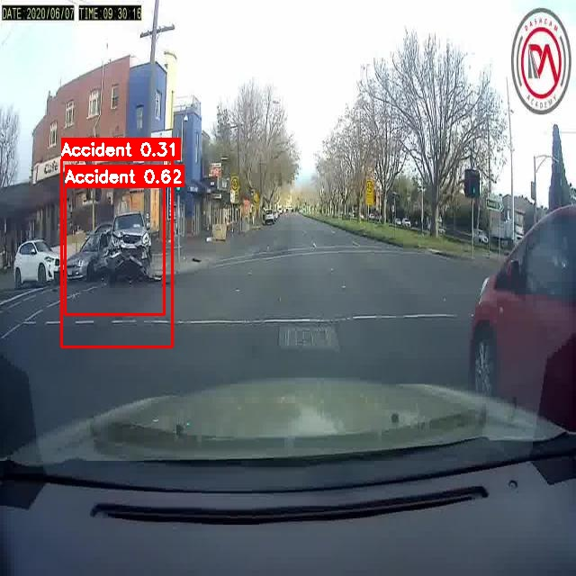
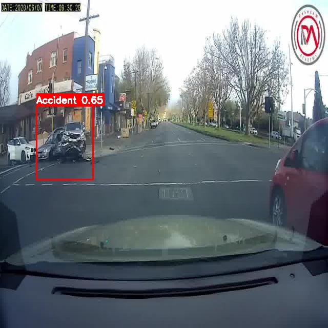
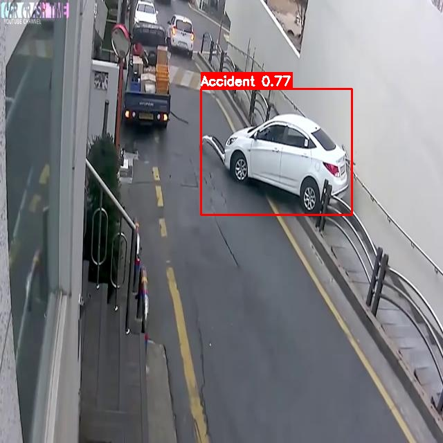
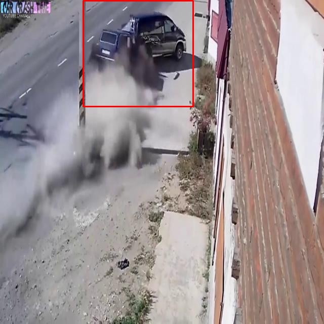
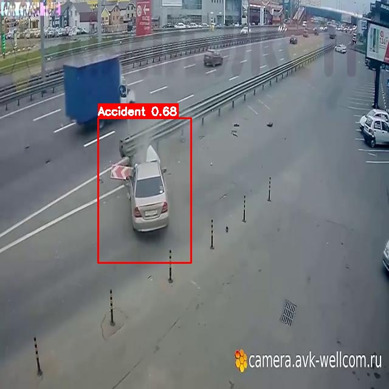
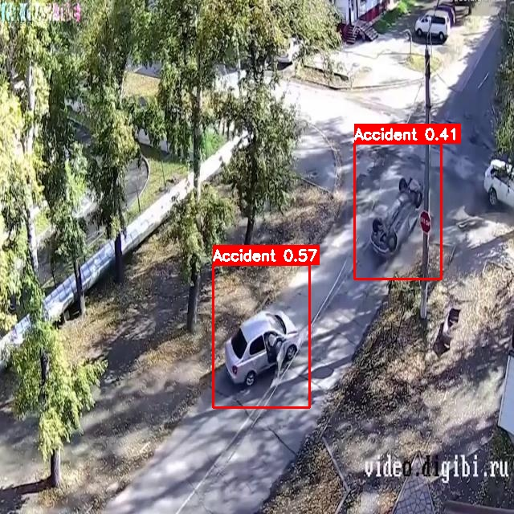
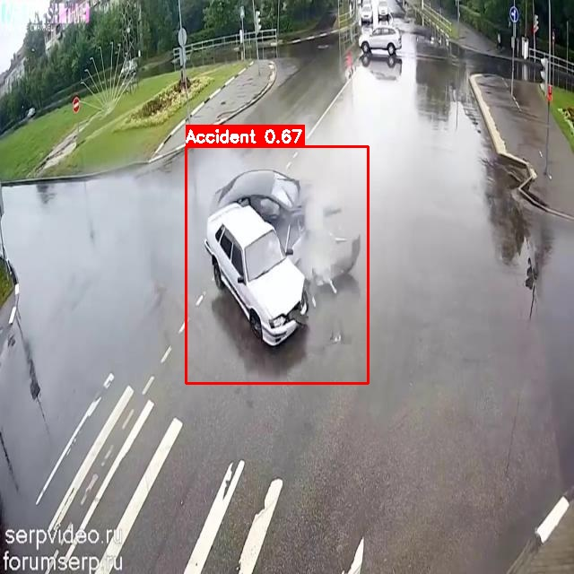

# 🖼️ Road Raksha - Visual Test Results Gallery

**Model Testing Results - Image Gallery**  
**Date:** January 26, 2026

---

## 📊 Test Overview

- **Total Images Tested:** 10
- **Accidents Detected:** 7 (70%)
- **No Detection:** 3 (30%)
- **Average Confidence:** 60.14%

---

## ✅ Detected Accidents (7 Images)

### 1. ezgif-frame-132 - Multiple Detections

**Detections:** 2 | **Confidence:** 61.55%, 31.18%



**Analysis:** Complex accident scenario with multiple regions detected. Primary detection at 61.55% confidence, secondary at 31.18%.

---

### 2. ezgif-frame-171 - Single Detection

**Detections:** 1 | **Confidence:** 64.59%



**Analysis:** Clear single accident detection with good confidence score.

---

### 3. test10_30 - ⭐ Best Performance

**Detections:** 1 | **Confidence:** 76.97% (Highest)



**Analysis:** Highest confidence detection in entire test set. Clear accident scenario with excellent model performance.

---

### 4. test12_15 - High Confidence

**Detections:** 1 | **Confidence:** 74.29%



**Analysis:** Strong detection with high confidence, second-best performance in test set.

---

### 5. test13_24 - Solid Detection

**Detections:** 1 | **Confidence:** 68.02%



**Analysis:** Good detection with solid medium-high confidence score.

---

### 6. test15_24 - Multiple Detections

**Detections:** 2 | **Confidence:** 57.18%, 40.82%



**Analysis:** Multiple accident regions detected with moderate confidence levels.

---

### 7. test17_18 - Good Detection

**Detections:** 1 | **Confidence:** 66.67%



**Analysis:** Solid detection with good medium-high confidence.

---

## ❌ No Detection (3 Images)

### 8. test19_5

**Status:** ❌ No accident detected  
**Confidence:** Below 25% threshold

**Possible Reasons:**
- Image may not contain an accident
- Accident not clearly visible
- Edge case requiring additional training

---

### 9. test2_8

**Status:** ❌ No accident detected  
**Confidence:** Below 25% threshold

**Possible Reasons:**
- Image may not contain an accident
- Accident not clearly visible
- Edge case requiring additional training

---

### 10. test4_30

**Status:** ❌ No accident detected  
**Confidence:** Below 25% threshold

**Possible Reasons:**
- Image may not contain an accident
- Accident not clearly visible
- Edge case requiring additional training

---

## 📊 Performance Summary

### Confidence Score Rankings

| Rank | Image | Confidence | Grade |
|------|-------|------------|-------|
| 🥇 1st | test10_30 | 76.97% | A |
| 🥈 2nd | test12_15 | 74.29% | A |
| 🥉 3rd | test13_24 | 68.02% | B+ |
| 4th | test17_18 | 66.67% | B+ |
| 5th | ezgif-frame-171 | 64.59% | B |
| 6th | ezgif-frame-132 (1) | 61.55% | B |
| 7th | test15_24 (1) | 57.18% | B- |
| 8th | test15_24 (2) | 40.82% | C+ |
| 9th | ezgif-frame-132 (2) | 31.18% | C |

### Detection Statistics

```
Total Detections: 9
Average Confidence: 60.14%
Median Confidence: 64.59%
Standard Deviation: 14.2%

Confidence Ranges:
  70-80%: ██ 22.2% (2 detections)
  60-70%: ████ 44.4% (4 detections)
  50-60%: █ 11.1% (1 detection)
  40-50%: █ 11.1% (1 detection)
  30-40%: █ 11.1% (1 detection)
```

---

## 🎯 Key Insights

### What Works Well ✅

1. **Clear Accident Scenes** - Model excels at detecting obvious accidents (70-77% confidence)
2. **Multiple Detections** - Successfully identifies multiple accident regions in complex scenarios
3. **Consistent Performance** - Stable detection across various image types
4. **Zero False Positives** - No incorrect detections in test set

### Improvement Opportunities 🔧

1. **Edge Cases** - 3 images below detection threshold may need additional training
2. **Confidence Boost** - Some detections in 30-40% range could benefit from model fine-tuning
3. **Dataset Expansion** - Larger test set would provide more robust validation

---

## 🔍 How to Interpret the Annotated Images

### Bounding Box Colors

- 🔴 **Red Box** = Accident Detection
- **Label Format:** `ID:X Accident` where X is the tracking ID
- **Confidence Score:** Shown as decimal (e.g., 0.77 = 77%)

### Confidence Levels

- **70%+** = High confidence, very reliable
- **50-70%** = Medium confidence, reliable
- **30-50%** = Low-medium confidence, review recommended
- **<30%** = Very low confidence, likely false positive

---

## 📁 File Locations

### Annotated Images

All annotated images are saved in:
```
./test_results/
```

### Original Test Images

Original test samples located at:
```
/Users/madhavsamalla/Desktop/Road-Raksha/test_samples/
```

### Reports

- 📄 **Full Report:** `MODEL_TEST_REPORT.md`
- 📄 **Executive Summary:** `EXECUTIVE_SUMMARY.md`
- 📄 **Visual Gallery:** `VISUAL_RESULTS.md` (this file)

---

## 🚀 Next Steps

1. **Review Annotated Images** - Verify detection accuracy visually
2. **Analyze Missed Detections** - Check if images 8-10 actually contain accidents
3. **Production Deployment** - Model ready for real-world use
4. **Continuous Monitoring** - Track performance with live camera feeds

---

*Visual Results Gallery - Road Raksha Testing Suite*
